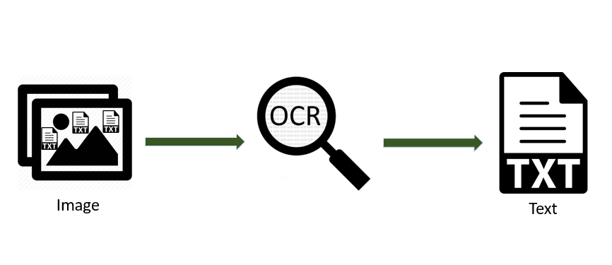

<!-- PROJECT LOGO -->
<br />
<p align="center">
  <a href="https://github.com/yohanalexander/character-recognition">
    
  </a>

  <h1 align="center">PBM OCR</h1>

  <p align="center">
    Reconhecimento de caracteres em imagens PBM!
    <br />


<!-- ABOUT THE PROJECT -->
## Sobre o projeto

Implementação do primeiro passo para um OCR em imagens no formato `.pbm`. O programa utiliza os conceitos de operadores morfológicos de processamento de imagens, para circunscrever as palavras em um texto.

<!-- GETTING STARTED -->
## Funcionamento

### Pré-requisitos

Para o funcionamento adequado são necessárias ferramentas para compilação de código C++.
* G++
* Make

Em sistemas linux utilize os comandos no terminal:
```sh
sudo apt install build-essential
sudo apt install make
```

### Compilação

Com as ferramentas instaladas para compilar o arquivo basta utilizar o comando `make` :
```sh
make
```
Caso queira limpar os arquivos de compilação use `make clean` :
```sh
make clean
```

<!-- USAGE EXAMPLES -->
### Uso
Para executar o programa basta rodar a main :
```sh
./main
Nome do arquivo pbm: teste.pbm
Resolucao: 1653x2338
Number of lines: 52
Number of words: 484
Number of letters: 3972
Saved destacada.pbm
```

